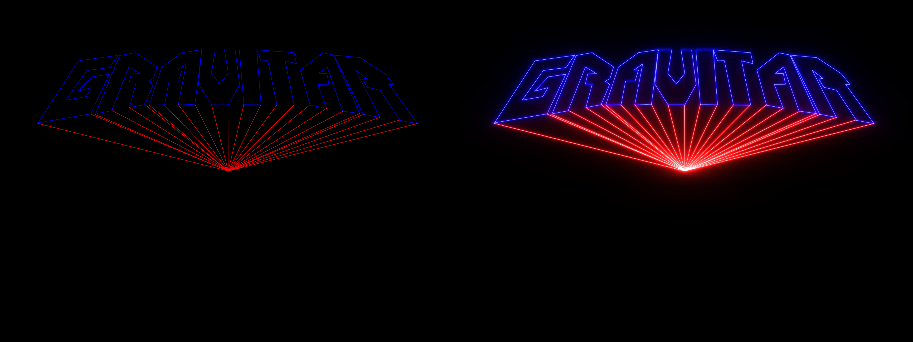
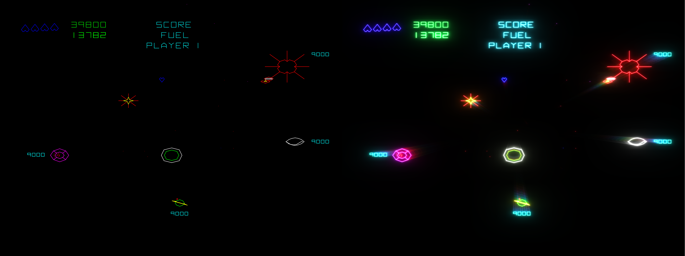
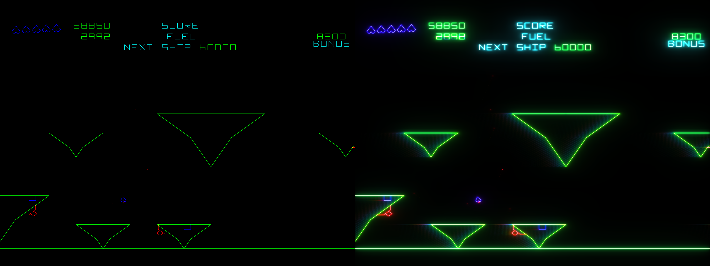
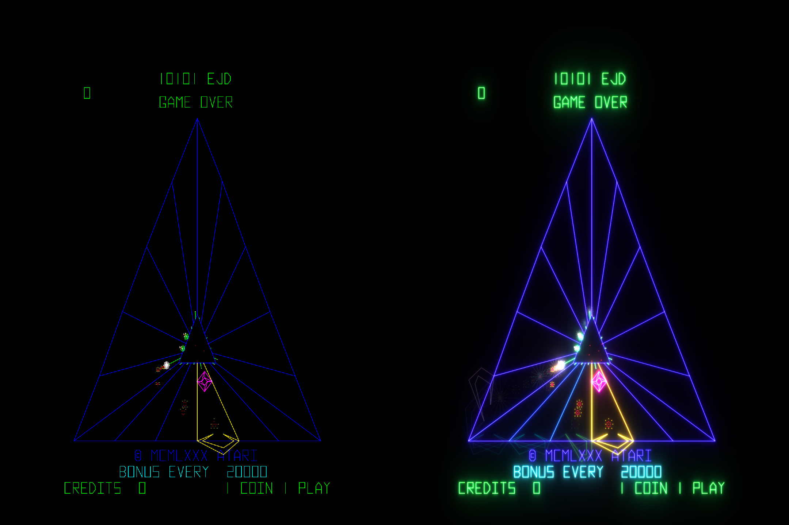
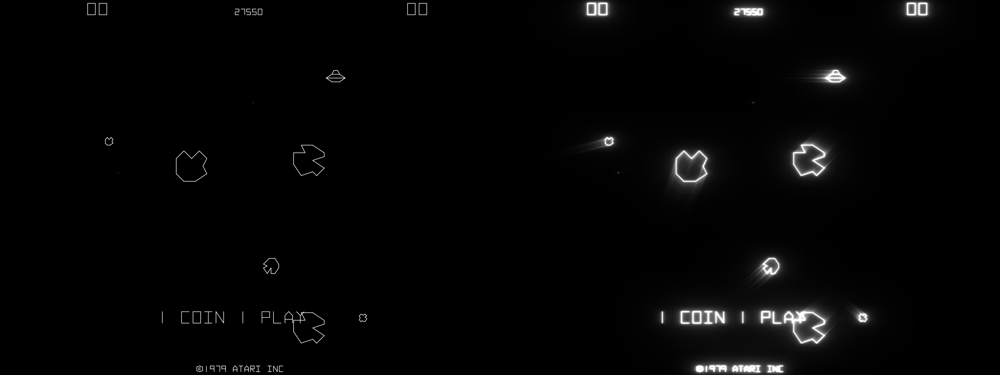
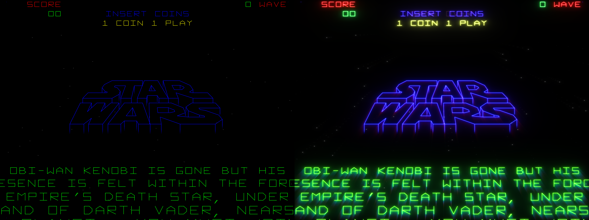
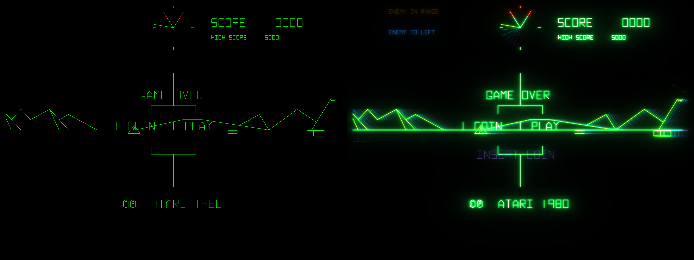
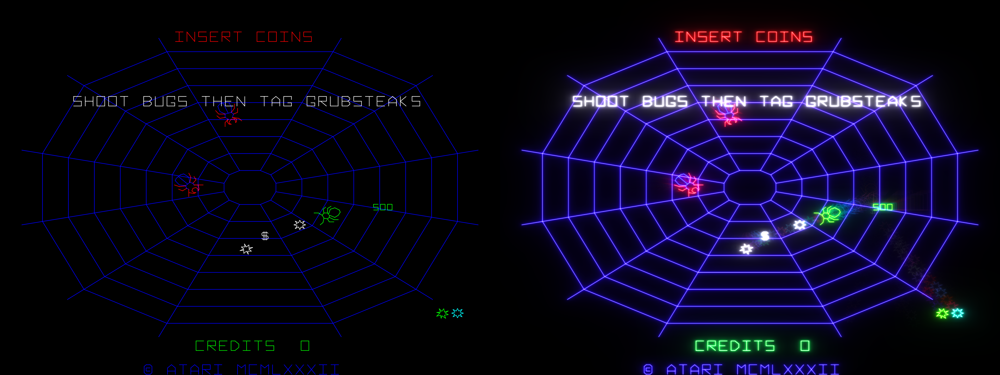

# moonbeam-shader

_A glow & ghosting shader pipeline for vector arcade games in RetroArch_

## Quick start guide

1. Download the latest release from the [Releases page](https://github.com/strawmoonVG/moonbeam-shader/releases)
2. Extract the files anywhere within RetroArch's `shaders` directory, for example, `RetroArch/shaders/shaders_slang/moonbeam/`
3. In RetroArch, go to **Quick Menu** → **Shaders** → **Load Preset** and select `moonbeam.slangp`
- (Optional) Experiment with **Quick Menu** → **Shaders** → **Shader Parameters** for customization
- (Optional) Save as default, or as a new preset, via **Quick Menu** → **Shaders** → **Manage Presets**

## Screenshot comparisons

### Gravitar

### Tempest

### Asteroids

### Star Wars

### Battlezone

### Black Widow

## Notes
- I made this for my personal use while developing [RetroAchievements for Gravitar](https://retroachievements.org/game/15080). No guarantees it'll work for your particular purpose.
- The shader code is unoptimized because I don't know what I'm doing. It does run without performance issues on my relatively old PC, however.
- No AI tools were used.
